# LaTeX

从数学公式入门，配合markdown在日常生活中使用更多。

## 1. 安装配置

### 1.1 windows

### 1.2 Liunx

1.搜索清华源，选择ＣＴＡＮ


2.选择ＴexLive

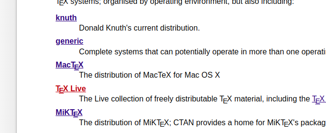

3.选择images->texlive(版本号).iso

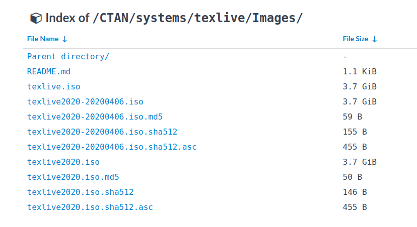


## 2. 数学

### 2.1 输入公式

LaTex公式有两种输入格式，一种是**行内公式**，嵌入在一行里面，如，$a=b+c$，另一种是**行间公式**。行间公式是将公式放置于两行之间。如
$$
a=b+c
$$
**行内公式**的输入是$$，行间则是\$\$\$\$，公式写在中间符号中间即可。


### 2.2 方程组

$$
\begin{equation}  
\left\{
  \begin{array}{r1}
  a_{0}+a_{1}x_{0}+...+a_{n}x_{0}^{n}=y_{0} \\
  a_{0}+a_{1}x_{1}+...+a_{n}x_{1}^{n}=y_{1} \\
  \cdots\\
  a_{0}+a_{1}x_{n}+...+a_{n}x_{n}^{n}=y_{n}
  \end{array}
\right.
\end{equation}
$$

```latex
\begin{equation}  
\left\{
  \begin{array}{r1}
  a_{0}+a_{1}x_{0}+...+a_{n}x_{0}^{n}=y_{0} \\
  a_{0}+a_{1}x_{1}+...+a_{n}x_{1}^{n}=y_{1} \\
  \cdots\\
  a_{0}+a_{1}x_{n}+...+a_{n}x_{n}^{n}=y_{n}
  \end{array}
\right.
\end{equation}
```


### 2.3 等式对齐

$$
\begin{align}

  x &= １ \\

  y &= 2 \\

  z &= x+y

\end{align}
$$

```latex
\begin{align}
  x &= １ \\
  y &= 2 \\
  z &= x+y
\end{align}
```


### 2.4 矩阵与行列式

$$
\left|\begin{array}{cccc} 
    1 &    3   & 6\\ 
    2 &    4   & 8\\ 
    3 &    6   & 9 
\end{array}\right|
$$


```latex
\[ 
\left|\begin{array}{cccc} 
    1 &    3   & 6\\ 
    2 &    4   & 8\\ 
    3 &    6   & 9 
\end{array}\right| 
\]
```

$$
\left[\begin{array}{cccc} 
    1 &    3   & 6\\ 
    2 &    4   & 8\\ 
    3 &    6   & 9 
\end{array}\right]
$$

```latex
\left[\begin{array}{cccc} 
    1 &    3   & 6\\ 
    2 &    4   & 8\\ 
    3 &    6   & 9 
\end{array}\right] 
```


### 2.5 符号

**表格来源于David Carlisle的symbols.tex，随后根据 Josef Tkadlec 的建议作了较 大的改动**

**https://github.com/davidcarlisle/dpctex/tree/master/maths-symbols**

#### 巨算符

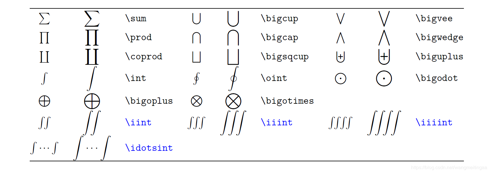

#### 希腊字母

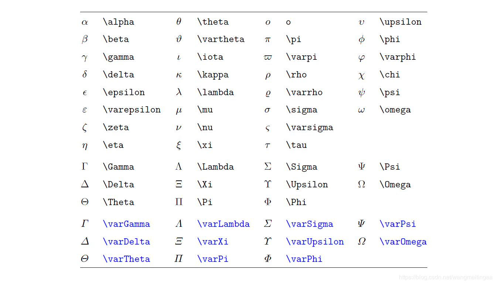

#### 二元关系符号

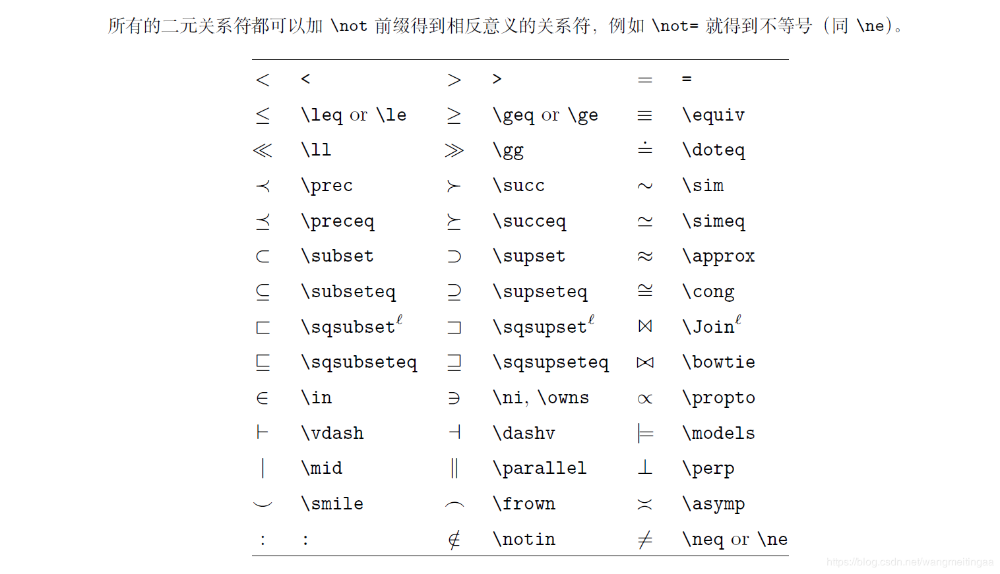

#### 二元运算符号

#### 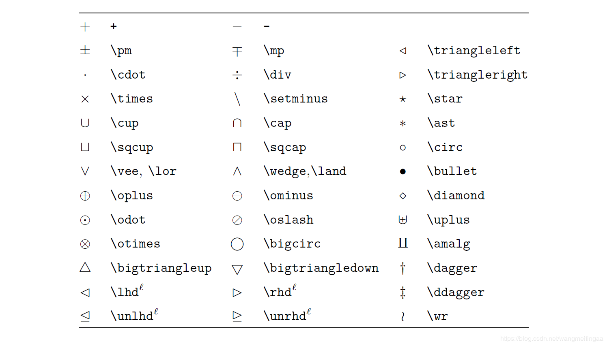箭头

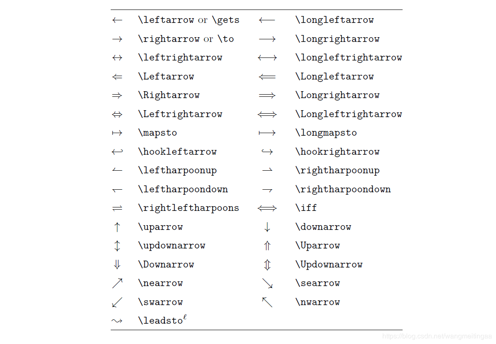

#### 定界符

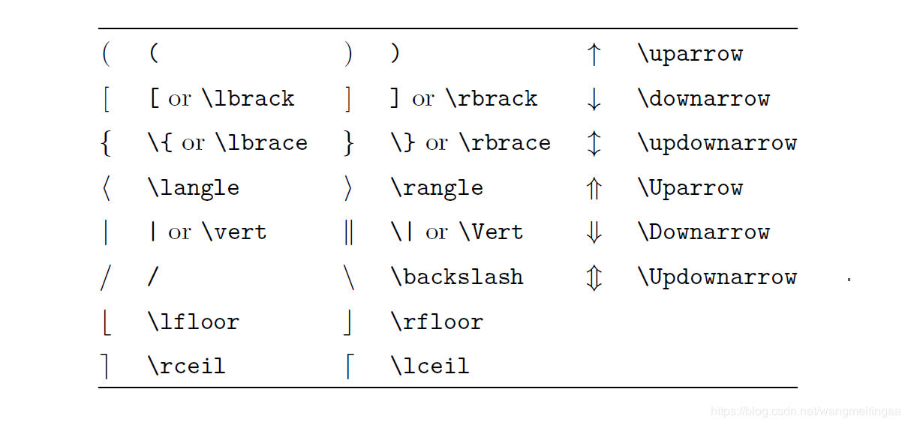

#### 重音符号

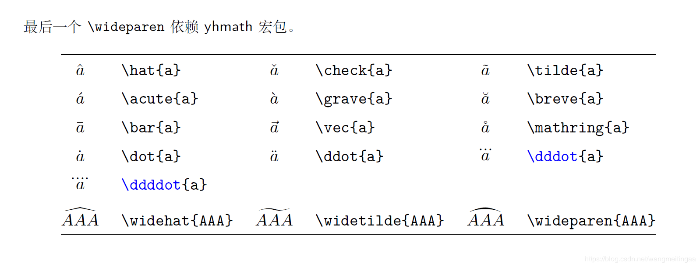

#### 行间公式大定界符

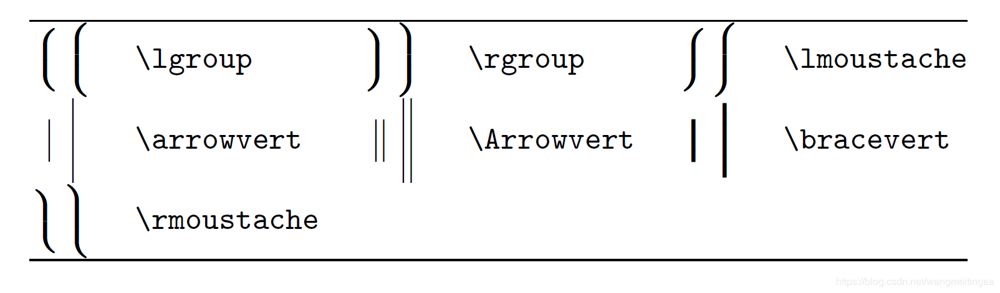

#### 其他

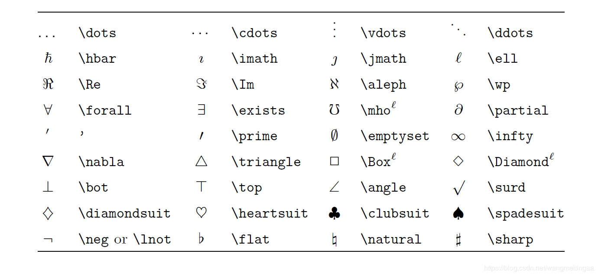

## 3. 排版

### 3.1 语言


### 3.2 组织

> ### 作者、标题、日期
>
> 保存并用 XeLaTeX 编译如下文档，查看效果：
>
> ```
> \documentclass[UTF8]{ctexart}
> \title{你好，world!}
> \author{Liam}
> \date{\today}
> \begin{document}
> \maketitle
> 你好，world!
> \end{document}
> ```
>
> 导言区复杂了很多，但和之前的文档主要的区别只有一处：定义了标题、作者、日期。
>
> 在 `document` 环境中，除了原本的`你好，world!`，还多了一个控制序列 `maketitle`。这个控制序列能将在导言区中定义的标题、作者、日期按照预定的格式展现出来。
>
> > 使用`titling`宏包可以修改上述默认格式。参考[TeXdoc](http://texdoc.net/texmf-dist/doc/latex/titling/titling.pdf)。
>
> ### 章节和段落
>
> 保存并用 XeLaTeX 编译如下文档，查看效果：
>
> ```
> \documentclass[UTF8]{ctexart}
> \title{你好，world!}
> \author{Liam}
> \date{\today}
> \begin{document}
> \maketitle
> \section{你好中国}
> 中国在East Asia.
> \subsection{Hello Beijing}
> 北京是capital of China.
> \subsubsection{Hello Dongcheng District}
> \paragraph{Tian'anmen Square}
> is in the center of Beijing
> \subparagraph{Chairman Mao}
> is in the center of 天安门广场。
> \subsection{Hello 山东}
> \paragraph{山东大学} is one of the best university in 山东。
> \end{document}
> ```
>
> 在文档类 `article`/`ctexart` 中，定义了五个控制序列来调整行文组织结构。他们分别是
>
> - `\section{·}`
> - `\subsection{·}`
> - `\subsubsection{·}`
> - `\paragraph{·}`
> - `\subparagraph{·}`
>
> > 在`report`/`ctexrep`中，还有`\chapter{·}`；在文档类`book`/`ctexbook`中，还定义了`\part{·}`。
>
> ### 插入目录
>
> 在上一节的文档中，找到 `\maketitle`，在它的下面插入控制序列 `\tableofcontents`，保存并用 XeLaTeX 编译**两次**，观察效果：
>
> ```
> \documentclass[UTF8]{ctexart}
> \title{你好，world!}
> \author{Liam}
> \date{\today}
> \begin{document}
> \maketitle
> \tableofcontents
> \section{你好中国}
> 中国在East Asia.
> \subsection{Hello Beijing}
> 北京是capital of China.
> \subsubsection{Hello Dongcheng District}
> \paragraph{Tian'anmen Square}
> is in the center of Beijing
> \subparagraph{Chairman Mao}
> is in the center of 天安门广场。
> \subsection{Hello 山东}
> \paragraph{山东大学} is one of the best university in 山东。
> \end{document}
> ```
>
> > 试试交换 `\maketitle` 和 `\tableofcontents` 的顺序，看看会发生什么，想想为什么。
>
> 请注意，在「你好中国」这一节中，两次「中国在East Asia.」中夹有一个空行，但输出却只有一个换行并没有空行。这是因为 LaTeX 将一个换行当做是一个简单的空格来处理，如果需要换行另起一段，则需要用两个换行（一个空行）来实现。


### 3.3 版面

> ## 版面设置
>
> ### 页边距
>
> 设置页边距，推荐使用 `geometry` 宏包。可以在[这里](http://texdoc.net/texmf-dist/doc/latex/geometry/geometry.pdf)查看它的说明文档。
>
> 比如我希望，将纸张的长度设置为 20cm、宽度设置为 15cm、左边距 1cm、右边距 2cm、上边距 3cm、下边距 4cm，可以在导言区加上这样几行：
>
> ```
> \usepackage{geometry}
> \geometry{papersize={20cm,15cm}}
> \geometry{left=1cm,right=2cm,top=3cm,bottom=4cm}
> ```
>
> ### 页眉页脚
>
> 设置页眉页脚，推荐使用 `fancyhdr` 宏包。可以在[这里](http://texdoc.net/texmf-dist/doc/latex/fancyhdr/fancyhdr.pdf)查看它的说明文档。
>
> 比如我希望，在页眉左边写上我的名字，中间写上今天的日期，右边写上我的电话；页脚的正中写上页码；页眉和正文之间有一道宽为 0.4pt 的横线分割，可以在导言区加上如下几行：
>
> ```
> \usepackage{fancyhdr}
> \pagestyle{fancy}
> \lhead{\author}
> \chead{\date}
> \rhead{152xxxxxxxx}
> \lfoot{}
> \cfoot{\thepage}
> \rfoot{}
> \renewcommand{\headrulewidth}{0.4pt}
> \renewcommand{\headwidth}{\textwidth}
> \renewcommand{\footrulewidth}{0pt}
> ```
>
> ### 首行缩进
>
> CTeX 宏集已经处理好了首行缩进的问题（自然段前空两格汉字宽度）。因此，使用 CTeX 宏集进行中西文混合排版时，我们不需要关注首行缩进的问题。
>
> > 如果你因为某些原因选择不适用 CTeX 宏集（不推荐）进行中文支持和版式设置，则你需要做额外的一些工作。
> >
> > - 调用 `indentfirst` 宏包。具体来说，中文习惯于每个自然段的段首都空出两个中文汉字的长度作为首行缩进，但西文行文习惯于不在逻辑节（`\section` 等）之后缩进。使用改宏包可使 LaTeX 在每个自然段都首行缩进。
> > - 设置首行缩进长度 `\setlength{\parindent}{2\ccwd}`。其中 `\ccwd` 是 `xeCJK` 定义的宏，它表示当前字号中一个中文汉字的宽度。
>
> ### 行间距
>
> 我们可以通过 `setspace` 宏包提供的命令来调整行间距。比如在导言区添加如下内容，可以将行距设置为字号的 1.5 倍：
>
> ```
> \usepackage{setspace}
> \onehalfspacing
> ```
>
> 具体可以查看该宏包的[文档](http://texdoc.net/texmf-dist/doc/latex/setspace/README)。
>
> > 请注意用词的差别：
> >
> > - 行距是字号的 1.5 倍；
> > - 1.5 倍行距。
> >
> > 事实上，这不是设置 1.5 倍行距的正确方法，请参考[这篇博文](https://liam.page/2013/10/17/LaTeX-Linespace/)。另外，[RuixiZhang](https://github.com/RuixiZhang42) 开发了 [zhlineskip](https://github.com/CTeX-org/ctex-kit/tree/master/zhlineskip) 宏包，提供了对中西文混排更细致的行距控制能力。
>
> ### 段间距
>
> 我们可以通过修改长度 `\parskip` 的值来调整段间距。例如在导言区添加以下内容
>
> ```
> \addtolength{\parskip}{.4em}
> ```
>
> 则可以在原有的基础上，增加段间距 0.4em。如果需要减小段间距，只需将该数值改为负值即可。

### 3.4 模板


## 参考资料

[1] https://github.com/davidcarlisle/dpctex/tree/master/maths-symbols

